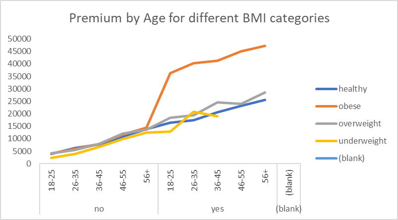
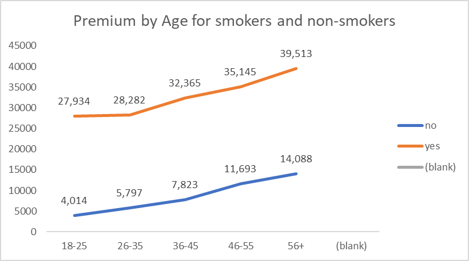
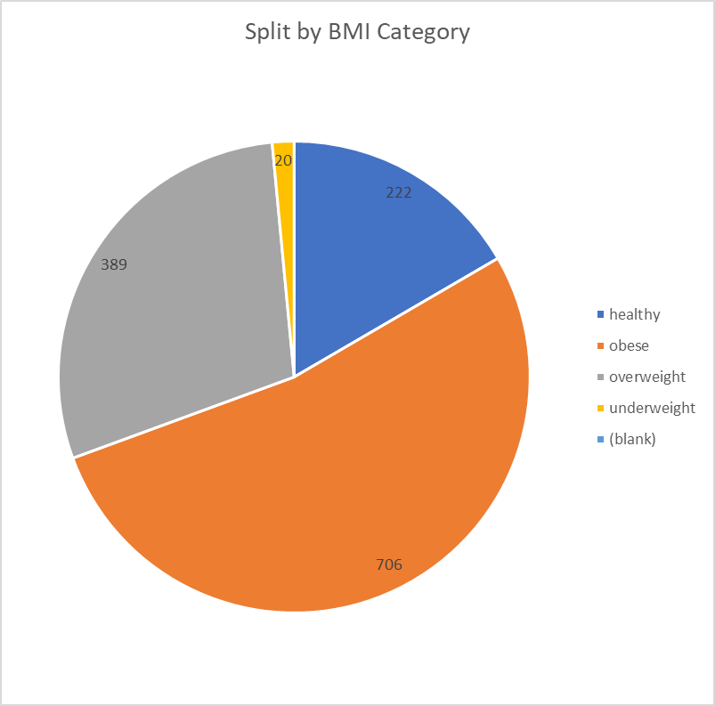
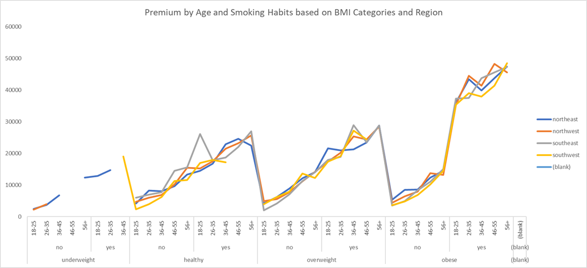

# insurance-premium-analysis-and-prediction
Analyzed an insurance dataset to uncover expense patterns across age, BMI, smoking habits, and regions. Performed data cleaning, EDA, and applied machine learning models to predict medical insurance costs, highlighting key drivers of expenses.

# Insurance Premium Analysis and Prediction

## 📌 Overview
This project analyzes health insurance premiums and predicts individual expenses based on demographic and lifestyle factors such as **age, BMI, and smoking habits**.  
The goal was twofold:  
1. **Uncover insights** about how different groups of people are charged for insurance.  
2. **Build ML models** to predict insurance expenses for new individuals.  

---

## 📊 Dataset
- **Source**: [Kaggle - Insurance Dataset](https://www.kaggle.com/)  
- **Description**: Contains demographic, lifestyle, and health-related data of individuals along with their insurance premium charges.  

---

## 🛠 Tools & Technologies
- **Python**: Data cleaning, feature engineering, and ML model building  
- **SQL**: Basic analysis and querying  
- **Excel**: Pivot charts & dashboards  

---

## 🔎 Process
1. **Data Cleaning**: Added new derived columns for BMI categories, smoker status, etc.  
2. **Exploratory Analysis (SQL)**: Wrote queries to analyze relationships between factors like smoking, BMI, and charges.  
3. **Visualization (Excel)**: Built pivot charts and dashboards for premium distribution.  
4. **Modeling (Python)**: Implemented ML models to predict insurance charges.  

---

## 📈 Key Insights
- **Smokers** pay **3.8x higher premiums** compared to non-smokers.  
- **Obese individuals** pay **1.5x more** on average than healthy individuals.  
- **Obese smokers** pay a staggering **5.4x more** than healthy non-smokers.  

---

## 💡 Potential Solutions
- **For insurers**: Develop targeted premium plans for smokers and obese individuals to balance risk.  
- **For policyholders**: Incentivize quitting smoking and healthy lifestyle adoption through discounts or wellness programs.  

---

## 🤖 Machine Learning Results
- Built  various regression models to predict insurance charges.  
- Achieved **R² = 0.857** using a **Random Forest Regressor**, indicating strong predictive performance.  

---

## 📊 Results & Dashboards
  

